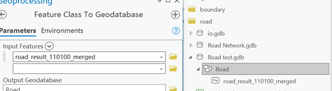
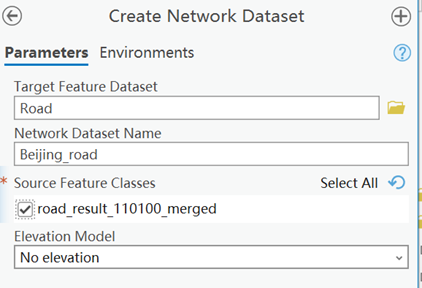
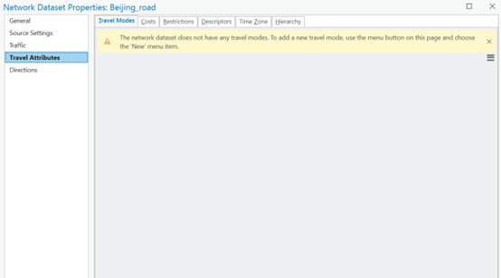
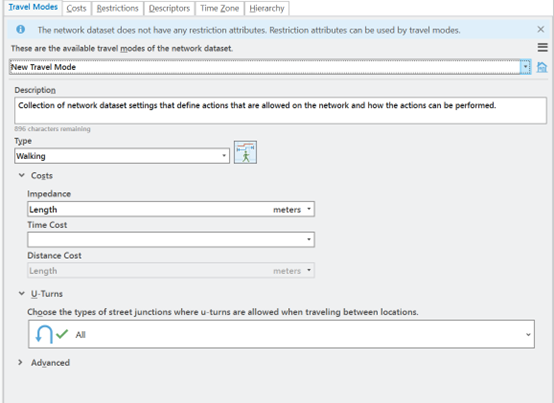

# Closest-Facilities

This tutorial provides step-by-step instructions on how to create a road network dataset using ArcGIS Pro and perform network analysis using the Closest Facility tool in the ArcPy module. The tutorial assumes you have basic knowledge of ArcGIS Pro and Python scripting.

## Prerequisites
- ArcGIS Pro installed on your computer
- RoadNetwork.shp file containing road network data and your facilities.shp files

## Step 1: Create a File Geodatabase and Import Road Network Data
1. Launch ArcGIS Pro and open a new project.
2. Right-click on the Catalog pane and select "New File Geodatabase."
3. Provide a name for the geodatabase, e.g., Road Network.gdb, and click "Save."
4. Right-click on the newly created geodatabase and select "New Feature Dataset."
5. Specify a name for the feature dataset, e.g., Road, and choose the appropriate coordinate system, such as GCS_WGS_1984.
6. Right-click on the feature dataset and select "Import > Feature Class (single)." 
7. Browse to locate the RoadNetwork.shp file and import it into the feature dataset.

    

8. Right-click on the Road, New Network Dataset.

           
    
9. Right-click Beijing_road, choose Properties to add Travel Mode. **Important**

      

## Step 2: Create Facilities Geodatabase
1. Right-click on the Catalog pane and select "New File Geodatabase."
2. Provide a name for the geodatabase, e.g., io.gdb, and click "Save."
